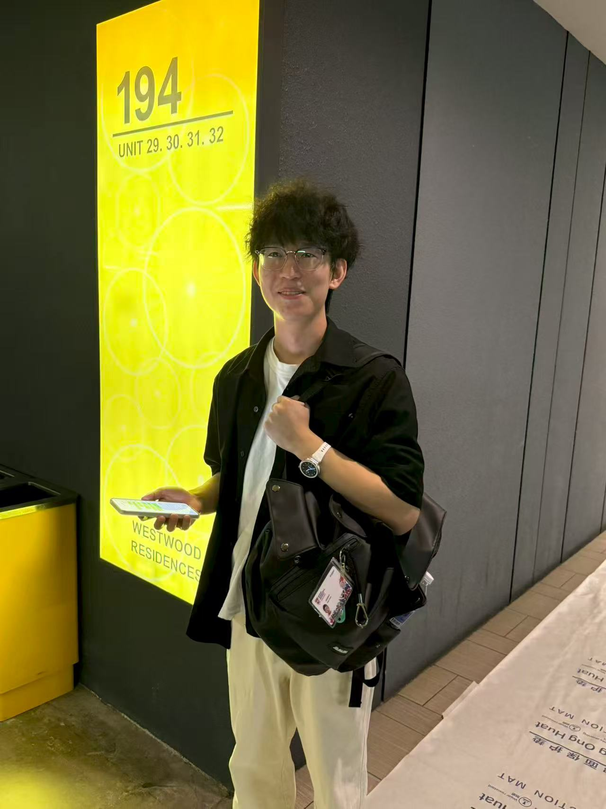
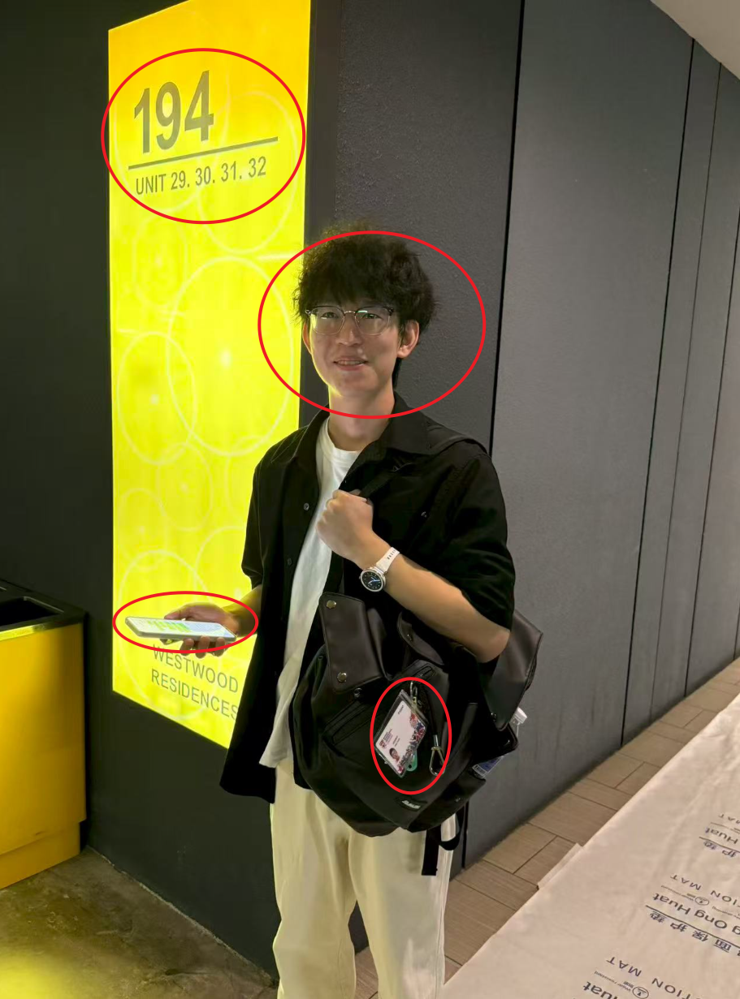
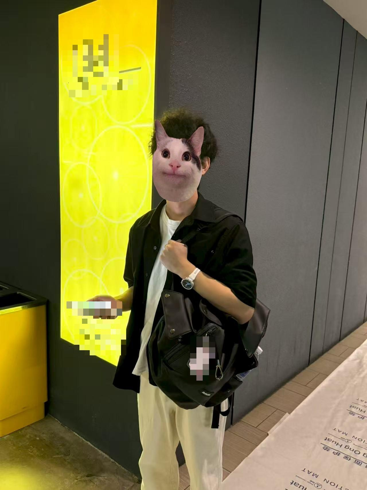

# Sentinel - Guardian of Privacy⚔️  
### Multimodal, On‑Device AI Privacy Guard 
> Detect • Understand • Anonymize — all locally.

---

## 🚨 The Challenge in Privacy

Modern sharing workflows (screenshots of chats/dashboards, audios, captions, prompts sent to LLMs) routinely leak:
- Bystander faces and creator identity linkages
- Emails, phone numbers, IDs, addresses, credentials
- Internal project names, partial tokens, API keys (in screenshots / prompts)
- Street & shop signage, license plates (location inference)
- Screen overlays (notifications, chat bubbles) captured unintentionally

Manual blurring is slow, inconsistent, and error-prone; cloud redaction services introduce a *second* exposure surface (logging, retention, model retraining). Sentinel brings a multilayer privacy firewall directly onto your device.

---

## ✨ Sentinel At a Glance
<p float="left">
  
  
  
</p>

Sentinel is your pre‑publish privacy shield: before you share a screenshot, send a prompt to an external AI, export a support log, or package a research dataset, it quietly sweeps your content for the usual suspects (faces, emails, phone numbers, IDs, screen text, signage, chat bubbles) and less obvious contextual clues (location hints, internal labels), then lets you instantly anonymize them with the style you prefer—fast automatic cleanup for quick sharing, or a deeper semantic pass when you need thorough assurance. Whether you’re a creator protecting bystanders, a team scrubbing screenshots, a researcher curating compliant datasets, or a developer sanitizing prompts, Sentinel turns privacy from a tedious afterthought into a smooth, on‑device, one‑click habit—no cloud, no waiting, no second exposure risk.

## 📦 Setup

### 1. Install Dependencies

```bash
pip install -r requirements.txt
```

### 2. Download Required Models
Download the PII detection models from: [https://drive.google.com/drive/folders/1fxljdNcruwfbLTIBIjWU-dLWR2z-Gn3U?usp=sharing](https://drive.google.com/drive/folders/1fxljdNcruwfbLTIBIjWU-dLWR2z-Gn3U?usp=sharing)

Available models:
- `pii_ettin_encoder_1b_v1` - Ettin 1B encoder model (recommended)
- `pii_ettin_encoder_400m_v1` - Ettin 400M encoder model
- `pii_deberta_base_v1` - DeBERTa-based PII detection model
- `pii_modernbert_base_v1` - ModernBERT-based PII detection model

Download the Qwen2.5vl-3B model from: [https://huggingface.co/Qwen/Qwen2.5-VL-3B-Instruct](https://huggingface.co/Qwen/Qwen2.5-VL-3B-Instruct)

### 3. Set Up Yolo

MacOS
```bash
curl -L -o yolov12l-face.pt "https://github.com/YapaLab/yolo-face/releases/download/v0.0.0/yolov12l-face.pt"

mkdir -p ~/.insightface/models

# Download InSwapper model
gdown "https://drive.google.com/uc?id=1krOLgjW2tAPaqV-Bw4YALz0xT5zlb5HF" \
  -O ~/.insightface/models/inswapper_128.onnx
```

Windows:
```bash
Invoke-WebRequest "https://github.com/YapaLab/yolo-face/releases/download/v0.0.0/yolov12l-face.pt" -OutFile "yolov12l-face.pt"

mkdir .insightface\models

gdown "https://drive.google.com/uc?id=1krOLgjW2tAPaqV-Bw4YALz0xT5zlb5HF" `
  -O ".insightface\models\inswapper_128.onnx"
```

---

## 🚀 Run & Test

Test media (multi-face images, signage, screen snippets) live with following commands:

### macOS / Linux
```bash
python3 launcher.py
```

### Windows
```powershell
python launcher.py
```

Try inside the GUI:
- Switch Fast ↔ Deep Mode
- Toggle anonymization styles (Blur / Pixelate / Emoji / Synthetic)
- Keep largest face (retain creator identity)
- Interactive face selection (click faces to include/exclude)
- Load signage / screen / chat images to see text region fusion

### Deep Mode
Enabled directly in the GUI (no extra command). Use signage / chat / dashboard images to showcase semantic sweep now!

---

## 💠 Core Features & Advantages

### Core Features
1. 100% On‑Device Processing  
   All detection & anonymization run locally—no uploads, no server round‑trips.

2. Dual Modes (Fast / Deep)  
   Fast Mode: instant face + obvious region cleanup.  
   Deep Mode: adds OCR + contextual + semantic PII sweep for maximum coverage.

3. Multimodal Coverage (Now)  
   Faces, textual PII (58+ classes), screen / signage / chat and audio.

4. Visual Anonymization Styles  
   Blur (Gaussian/Box/Median), Pixelate, Emoji overlay, High‑fidelity Synthetic Face Swap (InSwapper).

5. Text Privacy Engine  
   Structured entity tagging.

6. Bystander & Creator Controls  
   Keep largest face (retain presenter) or anonymize everyone; interactive include/exclude selection.

### Key Advantages
- Zero Secondary Exposure: Eliminates cloud logging & retention risks.
- Semantic Depth: Goes beyond plain OCR—catches contextual & implicit sensitive cues.
- Fast-to-Use: GUI + one-click mode switching encourages habitual pre‑publish scrubbing.
- Aesthetic Flexibility: Choose the anonymization style that matches your brand or compliance needs.
- Compliance Ready: Deterministic policies + audit manifest support internal review & documentation.
---

## 🧱 Tech Stack (Key libraries only)

### Computer Vision & Image Processing
ultralytics  
insightface  
onnxruntime  
opencv-python  
Pillow  
albumentations  
scikit-image  

### ML / NLP / PII
torch  
torchvision  
transformers  
huggingface-hub  
openai-whisper  
scikit-learn  
safetensors  
tiktoken  

### Audio / Speech
PyAudio  
Whisper  

### GUI / UX
tkinter  
customtkinter  
tkinter-tooltip  

### Data / Performance
numpy  
numba  

### OCR
EasyOCR

## 🛡️ Privacy & Ethical Stance

- No re-identification or inversion tooling  
- Irreversible transformations (configurable but protective defaults)  
- All processing in volatile local scope; nothing phoned home  
- Manifest export optional & user-controlled  
- Focus on minimizing false negatives while allowing manual override for edge cases  

---

## ⚠️ Disclaimer (TikTok TechJam 2025 Submission)

- This repository represents a 2025 TikTok TechJam submission project / hackathon prototype, not a finalized commercial product.  
- It is NOT endorsed, certified, or officially affiliated with TikTok beyond participation in the TechJam event. All trademarks belong to their respective owners.  
- Functionality is experimental and may contain inaccuracies, missed detections (false negatives), or over-blocking (false positives). Always perform a manual review before distributing any processed media.  
- No guarantee of legal or regulatory compliance (e.g., GDPR, HIPAA, FERPA, COPPA). You are solely responsible for ensuring outputs meet your organizational and jurisdictional requirements.  
- Not a substitute for professional legal, security, or compliance advice.  
- Synthetic face replacement is intended strictly for privacy preservation of bystanders; do not use it for impersonation, harassment, or deceptive manipulation.  
- Third-party models, datasets, and dependencies are used under their respective licenses; review them before production use.  
- Provided “as is” without warranty of any kind (express or implied). Use at your own risk.  
- If you incorporate Sentinel into production workflows, harden the pipeline (model pinning, reproducible builds, dependency scanning, adversarial testing) and conduct independent privacy + security audits.  

By using this code you acknowledge these limitations and responsibilities.

---

## 📚 Links

- For detailed documentation about Sentinel's architecture, model details, evaluation tests, and advanced usage guides, please visit:  
[**Model Finetuning and Evaluation Details →**](https://github.com/Maxxtucker/Tiktok-TechJam-Sentinel/blob/master/pii-text-detector(train)/README.md)
[**Sentinel Documentation →**](https://github.com/ki1r0/Tiktok-TechJam-Sentinel/blob/master/Documentation.md)
- Our Demo video: 

---

## 📑 Citations
```
@misc{weller2025seqvsseqopen,
  title         = {Seq vs Seq: An Open Suite of Paired Encoders and Decoders},
  author        = {Orion Weller and Kathryn Ricci and Marc Marone and Antoine Chaffin and Dawn Lawrie and Benjamin Van Durme},
  year          = {2025},
  eprint        = {2507.11412},
  archiveprefix = {arXiv},
  primaryclass  = {cs.CL},
  url           = {https://arxiv.org/abs/2507.11412}
}
```
```
@misc{modernbert,
  title         = {Smarter, Better, Faster, Longer: A Modern Bidirectional Encoder for Fast, Memory Efficient, and Long Context Finetuning and Inference},
  author        = {Benjamin Warner and Antoine Chaffin and Benjamin Clavié and Orion Weller and Oskar Hallström and Said Taghadouini and Alexis Gallagher and Raja Biswas and Faisal Ladhak and Tom Aarsen and Nathan Cooper and Griffin Adams and Jeremy Howard and Iacopo Poli},
  year          = {2024},
  eprint        = {2412.13663},
  archiveprefix = {arXiv},
  primaryclass  = {cs.CL},
  url           = {https://arxiv.org/abs/2412.13663}
}
```
```
@misc{he2021debertav3,
  title         = {DeBERTaV3: Improving DeBERTa using ELECTRA-Style Pre-Training with Gradient-Disentangled Embedding Sharing},
  author        = {Pengcheng He and Jianfeng Gao and Weizhu Chen},
  year          = {2021},
  eprint        = {2111.09543},
  archiveprefix = {arXiv},
  primaryclass  = {cs.CL}
}
```
```
@inproceedings{he2021deberta,
  title     = {DEBERTA: DECODING-ENHANCED BERT WITH DISENTANGLED ATTENTION},
  author    = {Pengcheng He and Xiaodong Liu and Jianfeng Gao and Weizhu Chen},
  booktitle = {International Conference on Learning Representations},
  year      = {2021},
  url       = {https://openreview.net/forum?id=XPZIaotutsD}
}
```
```
@misc{ai4privacy_2023,
  author     = {ai4Privacy},
  title      = {pii-masking-200k (Revision 1d4c0a1)},
  year       = {2023},
  url        = {https://huggingface.co/datasets/ai4privacy/pii-masking-200k},
  doi        = {10.57967/hf/1532},
  publisher  = {Hugging Face}
}
```
```
@article{Qwen2.5-VL,
  title={Qwen2.5-VL Technical Report},
  author={Bai, Shuai and Chen, Keqin and Liu, Xuejing and Wang, Jialin and Ge, Wenbin and Song, Sibo and Dang, Kai and Wang, Peng and Wang, Shijie and Tang, Jun and Zhong, Humen and Zhu, Yuanzhi and Yang, Mingkun and Li, Zhaohai and Wan, Jianqiang and Wang, Pengfei and Ding, Wei and Fu, Zheren and Xu, Yiheng and Ye, Jiabo and Zhang, Xi and Xie, Tianbao and Cheng, Zesen and Zhang, Hang and Yang, Zhibo and Xu, Haiyang and Lin, Junyang},
  journal={arXiv preprint arXiv:2502.13923},
  year={2025}
}
```
<p align="center"><b>Sentinel — Share boldly. Reveal wisely.</b></p>
